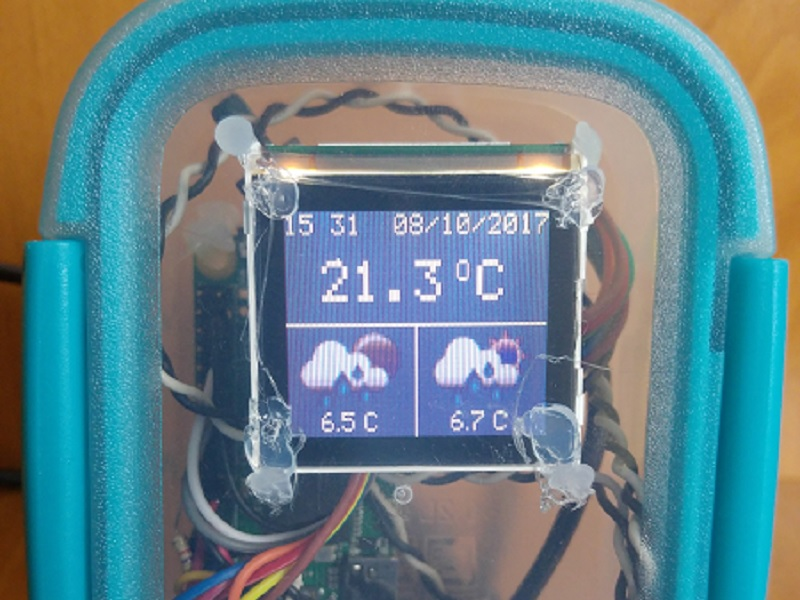
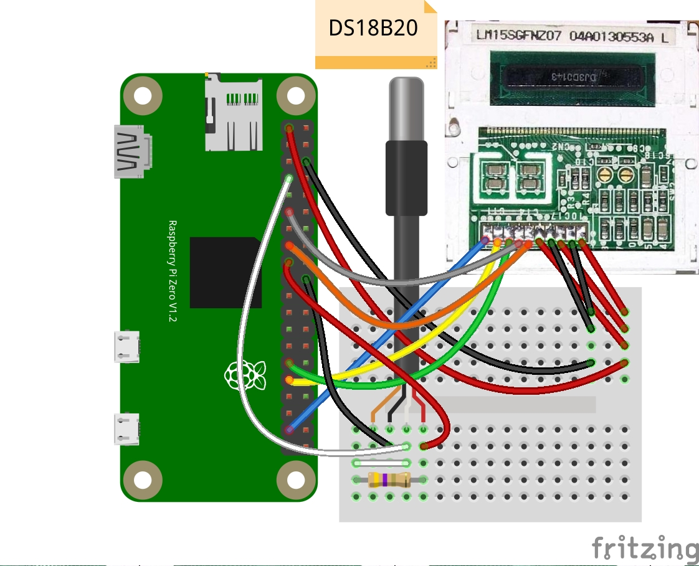

# SmarThermo example

## Overview
This project introduces smart thermometer which leverages 1-wire temperature sensor and WiFi connection to get whether
forecast for the closest night and the next day.

## Components
Mandatory:
- Raspberry Pi Zero W,
- LM15SGFNZ07 cheap display from old Siemens phones,
- DS18B20 1-wire temperature sensor,
- Resistor of value 4k7,
- SD card,
- USB cable to deliver power.

Optional:
- Case,
- On/Off button to be able to safely power off the Raspberry Pi. 

## Prototype

## Schematic diagram

